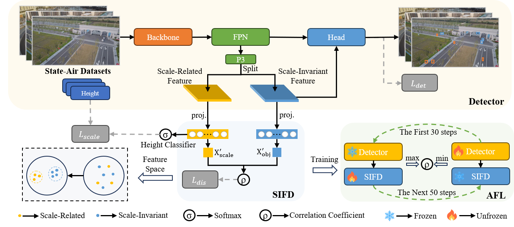

# SIFAD: Scale-Invariant Features Adversarial Disentanglement for UAV Object Detection

### Introduction

Welcome to the official repository of our paper "Scale-Invariant Features Adversarial Disentanglement for UAV Object Detection"

In this repository, we will provide our code (SIFAD) and Dataset (State-Air).